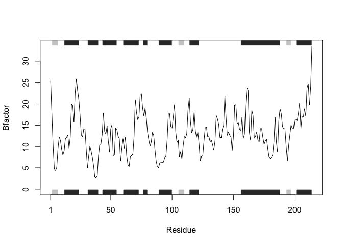

# Homework 6 - (R Functions
Brian Wong (PID: A18639001)

Drug_analysis function takes a set of proteins from a database and runs
analysis on drug interactions and displays results graphically.

To use this function, call the `drug_analysis()` function with a single
or multiple 4 character protein tag from the protein database to run
analysis.

``` r
drug_analysis <- function(pdb_id){
  # pdb_id input is a set of ID inputs from the pdb database
  library(bio3d)
  
  for(i in 1:length(pdb_id)){
    s <- read.pdb(pdb_id[i])
    s.chainA <- trim.pdb(s, chain="A", elety = "CA")
    s.b <- s.chainA$atom$b
    plotb3(s.b, sse=s.chainA, typ="l", ylab="Bfactor")
  }
}
```

Test code that displays the results of the function, `drug_analysis()`
of 3 different proteins.

``` r
drug_analysis(c("4AKE", "1AKE", "1E4Y"))
```

      Note: Accessing on-line PDB file


      Note: Accessing on-line PDB file
       PDB has ALT records, taking A only, rm.alt=TRUE


      Note: Accessing on-line PDB file


