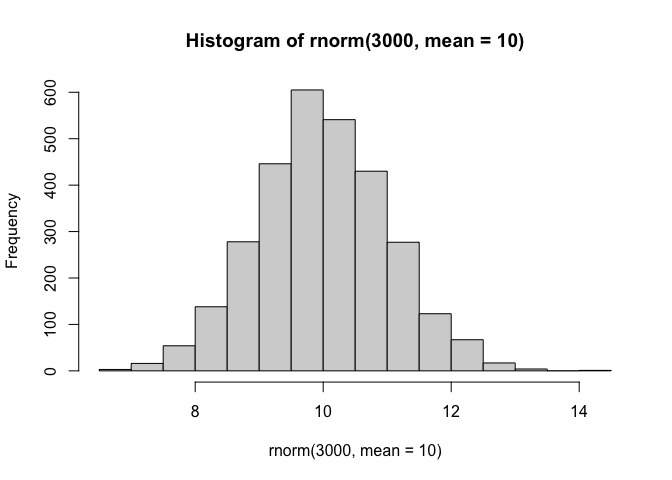
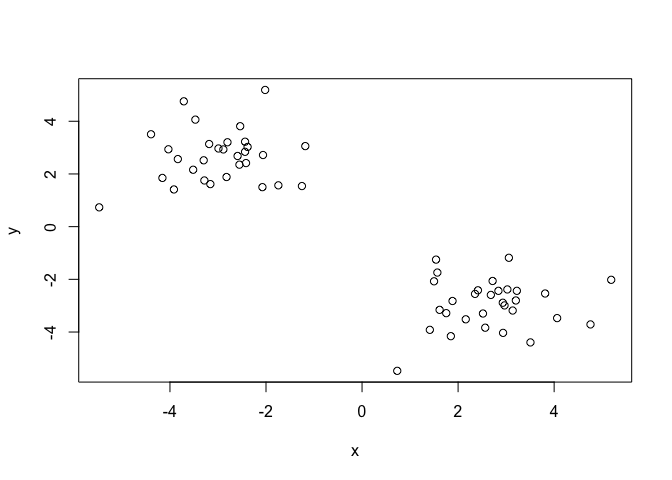
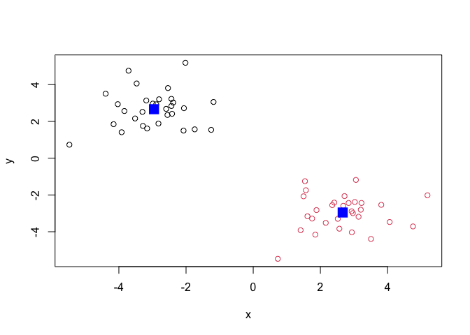
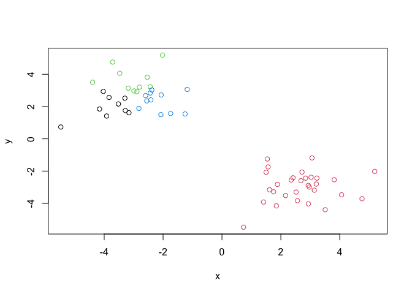
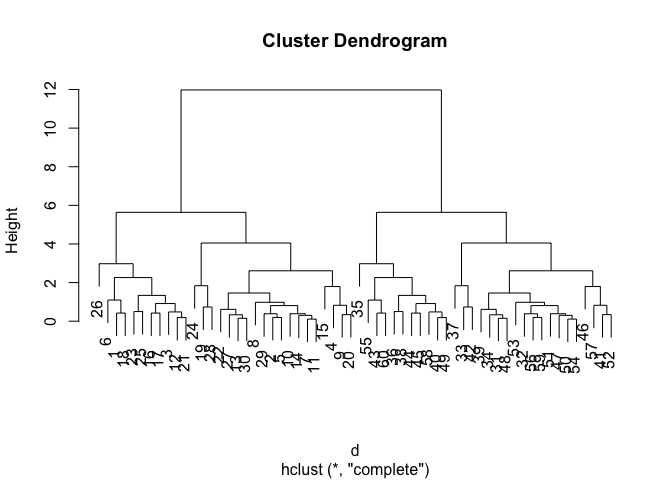
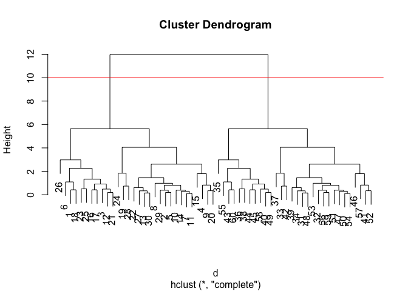
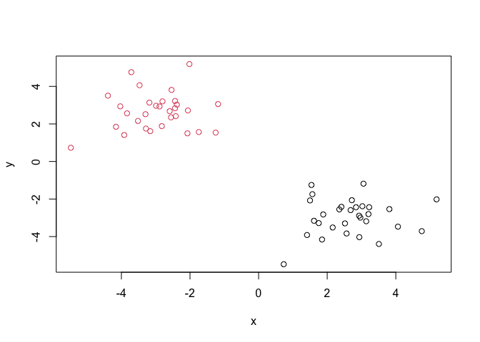
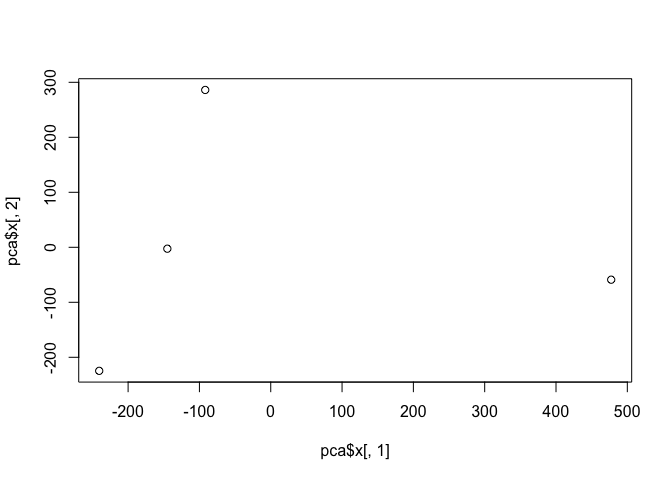
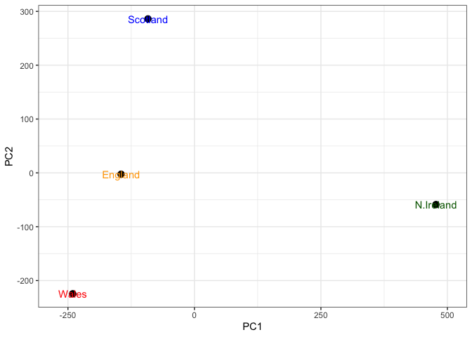
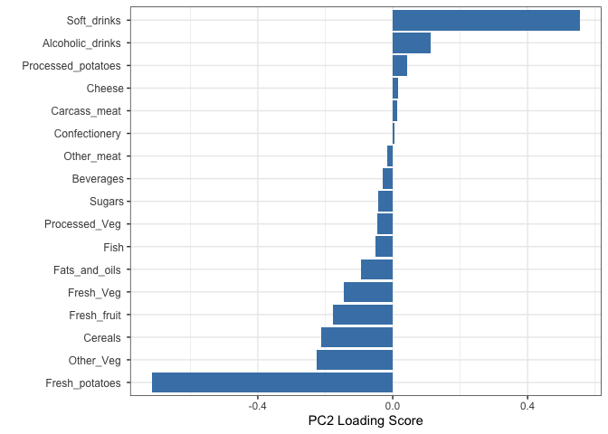

# Class 7: Machine Learning 1
Brian Wong (PID:A18639001)

## Background

Today we will begin our exploration of important machine learning
methods with a focus on **clustering** and **dimensionallity
reduction**.

To start testing these methods, let’s make up some sample data to
cluster where we know what the answer should be.

``` r
hist(rnorm(3000, mean = 10))
```



> Q. Can you generate 30 numbers centered at +3 and 30 numbers at -3
> taken at random from a normal distribution?

``` r
tmp <- c(rnorm(30, mean = 3), rnorm(30, mean = -3))

x<- cbind(x=tmp, y=rev(tmp))
plot(x)
```



## K-means clustering

The main function in “base R” for K-means clustering is called
`kmeans()`, let’s try it out:

``` r
k <- kmeans(x, center = 2)
k
```

    K-means clustering with 2 clusters of sizes 30, 30

    Cluster means:
              x         y
    1 -2.954009  2.663606
    2  2.663606 -2.954009

    Clustering vector:
     [1] 2 2 2 2 2 2 2 2 2 2 2 2 2 2 2 2 2 2 2 2 2 2 2 2 2 2 2 2 2 2 1 1 1 1 1 1 1 1
    [39] 1 1 1 1 1 1 1 1 1 1 1 1 1 1 1 1 1 1 1 1 1 1

    Within cluster sum of squares by cluster:
    [1] 54.71304 54.71304
     (between_SS / total_SS =  89.6 %)

    Available components:

    [1] "cluster"      "centers"      "totss"        "withinss"     "tot.withinss"
    [6] "betweenss"    "size"         "iter"         "ifault"      

> Q. What compoonent of your kmeans result object has the cluster
> centers?

``` r
k$centers
```

              x         y
    1 -2.954009  2.663606
    2  2.663606 -2.954009

> Q. What compoonent of your kmeans result object has the cluster size
> (i.e. how many points are in each cluster)?

``` r
k$size
```

    [1] 30 30

> Q. What compoonent of your kmeans result object has the cluster
> membership vector (i.e. the main clustering result: which points are
> in each cluster)?

``` r
k$cluster
```

     [1] 2 2 2 2 2 2 2 2 2 2 2 2 2 2 2 2 2 2 2 2 2 2 2 2 2 2 2 2 2 2 1 1 1 1 1 1 1 1
    [39] 1 1 1 1 1 1 1 1 1 1 1 1 1 1 1 1 1 1 1 1 1 1

> Q. Plot the results of clustering (i.e. our data colored by the
> clustering result) along with the cluster centers.

``` r
plot(x, col=k$cluster)
points(k$centers, col = "blue", pch = 15, cex=2)
```



> Q. Can you run `kmeans()` again and cluster `x` into 4 clusters and
> plot the results just like we did above with coloring by cluster and
> the cluster centers shown in blue?

``` r
y <- kmeans(x, center = 4)
y
```

    K-means clustering with 4 clusters of sizes 9, 30, 10, 11

    Cluster means:
              x         y
    1 -3.852470  1.948906
    2  2.663606 -2.954009
    3 -3.043248  3.678620
    4 -2.137776  2.325620

    Clustering vector:
     [1] 2 2 2 2 2 2 2 2 2 2 2 2 2 2 2 2 2 2 2 2 2 2 2 2 2 2 2 2 2 2 4 3 3 4 1 1 3 1
    [39] 4 1 4 3 1 1 1 4 3 4 1 3 3 4 3 3 3 4 4 4 4 1

    Within cluster sum of squares by cluster:
    [1]  7.633421 54.713040  9.664848  6.585166
     (between_SS / total_SS =  92.6 %)

    Available components:

    [1] "cluster"      "centers"      "totss"        "withinss"     "tot.withinss"
    [6] "betweenss"    "size"         "iter"         "ifault"      

``` r
plot(x, col = y$cluster)
```



> **Key-point:** Kmeans will always return the clustering that we ask
> for ( this is the “K” or “centers” in K-means)!

``` r
k$tot.withinss
```

    [1] 109.4261

## Hierarchical clustering

The main function for Hierarchical clustering in base R is called
`hclust()`.

One of the main differences with respect to the `kmeans()` function is
that you can not just pass your input data directly to `hclust()` - it
needs a “distance matrix” as input. We can get this from lot’s of places
including the `dist()` function.

``` r
d <- dist(x)
hc <- hclust(d)
plot(hc)
```



We can “cut” the dendrogram or “tree” at a given height to yield our
“clusters”. For this, we use the function `cutree()`

``` r
plot(hc)
abline(h=10, col = "red")
```



``` r
grps <- cutree(hc, h=10)
```

``` r
grps
```

     [1] 1 1 1 1 1 1 1 1 1 1 1 1 1 1 1 1 1 1 1 1 1 1 1 1 1 1 1 1 1 1 2 2 2 2 2 2 2 2
    [39] 2 2 2 2 2 2 2 2 2 2 2 2 2 2 2 2 2 2 2 2 2 2

> Q. Plot our data `x` colored by the clusterinv result from `hclust()`
> and `cutree()`?

``` r
plot(x, col = grps)
```



## Principal Component Analysis (PCA)

PCA is a popular dimensionality reduction technique that is widely used
in bioinformatics

### PCA of UK food data

Read data on food consumption in the UK

``` r
url <- "https://tinyurl.com/UK-foods"
x <- read.csv(url)
x
```

                         X England Wales Scotland N.Ireland
    1               Cheese     105   103      103        66
    2        Carcass_meat      245   227      242       267
    3          Other_meat      685   803      750       586
    4                 Fish     147   160      122        93
    5       Fats_and_oils      193   235      184       209
    6               Sugars     156   175      147       139
    7      Fresh_potatoes      720   874      566      1033
    8           Fresh_Veg      253   265      171       143
    9           Other_Veg      488   570      418       355
    10 Processed_potatoes      198   203      220       187
    11      Processed_Veg      360   365      337       334
    12        Fresh_fruit     1102  1137      957       674
    13            Cereals     1472  1582     1462      1494
    14           Beverages      57    73       53        47
    15        Soft_drinks     1374  1256     1572      1506
    16   Alcoholic_drinks      375   475      458       135
    17      Confectionery       54    64       62        41

It looks like the row names are not set properly. We can fix this

``` r
rownames(x) <- x[,1]
x <- x[,-1]
x
```

                        England Wales Scotland N.Ireland
    Cheese                  105   103      103        66
    Carcass_meat            245   227      242       267
    Other_meat              685   803      750       586
    Fish                    147   160      122        93
    Fats_and_oils           193   235      184       209
    Sugars                  156   175      147       139
    Fresh_potatoes          720   874      566      1033
    Fresh_Veg               253   265      171       143
    Other_Veg               488   570      418       355
    Processed_potatoes      198   203      220       187
    Processed_Veg           360   365      337       334
    Fresh_fruit            1102  1137      957       674
    Cereals                1472  1582     1462      1494
    Beverages                57    73       53        47
    Soft_drinks            1374  1256     1572      1506
    Alcoholic_drinks        375   475      458       135
    Confectionery            54    64       62        41

A better way to do this is fix the row names assignment at import time:

``` r
x <- read.csv(url, row.names = 1)
```

> Q1. How many rows and columns are in your new data frame named x? What
> R functions could you use to answer this questions?

``` r
dim(x)
```

    [1] 17  4

> Q2. Which approach to solving the ‘row-names problem’ mentioned above
> do you prefer and why? Is one approach more robust than another under
> certain circumstances?

2nd one is better. Repeated “x \<- x\[,-1\]” results in unwanted
deletion of columns

### Spotting Major Differences and Trends

``` r
barplot(as.matrix(x), beside=T, col=rainbow(nrow(x)))
```


> Q3: Changing what optional argument in the above barplot() function
> results in the following plot?

Changing the “beside” argument results in the change of the following
plot

``` r
barplot(as.matrix(x), beside=F, col=rainbow(nrow(x)))
```


``` r
library(tidyr)

# Convert data to long format for ggplot with `pivot_longer()`
x_long <- x |> 
          tibble::rownames_to_column("Food") |> 
          pivot_longer(cols = -Food, 
                       names_to = "Country", 
                       values_to = "Consumption")

dim(x_long)
```

    [1] 68  3

Grouped Bar Plot

``` r
library(ggplot2)

ggplot(x_long) +
  aes(x = Country, y = Consumption, fill = Food) +
  geom_col(position = "dodge") +
  theme_bw()
```


> Q4: Changing what optional argument in the above ggplot() code results
> in a stacked barplot figure?

Removing the position argument in `geom_col()` results in a stacked
barplot figure

``` r
library(ggplot2)

ggplot(x_long) +
  aes(x = Country, y = Consumption, fill = Food) + 
  geom_col() +
  theme_bw()
```


### Pairs Plots and Heatmaps

> Q5: We can use the pairs() function to generate all pairwise plots for
> our countries. Can you make sense of the following code and resulting
> figure? What does it mean if a given point lies on the diagonal for a
> given plot?

Each plot pairs one country against another country in terms of food
consumption. The dots on the graph are the different categories of food
consumption. If a given point lies on the diagonal, it means that the
consumption of the food in the category between the two countries is the
same.

``` r
pairs(x, col=rainbow(nrow(x)), pch=16)
```


### Heatmap

We can install the **pheatmap** package with the `install.packages()`
command that we used previously. Remember that we always run this in the
console and not a code chunk in our quarto document.

``` r
library(pheatmap)

pheatmap( as.matrix(x) )
```


Of all these plots, really only the `pairs()` plot was useful. This
however took a bit of work to interpret and will at scale will be
helpful when I am looking at much bigger datasets.

> Q6. Based on the pairs and heatmap figures, which countries cluster
> together and what does this suggest about their food consumption
> patterns? Can you easily tell what the main differences between N.
> Ireland and the other countries of the UK in terms of this data-set?

Based on this heatmap, England and Wales cluster together suggesting
that their food consumption patterns are similar to each other. The main
differences between N. Ireland and the other countries of the UK are the
consumption of Cereals, soft drinks, fresh fruit, other meat, and fresh
potatoes.

### PCA to the rescue

The main function in “base R” for PCA is called `prcomp()`.

``` r
pca <- prcomp( t(x) )
summary(pca)
```

    Importance of components:
                                PC1      PC2      PC3     PC4
    Standard deviation     324.1502 212.7478 73.87622 2.7e-14
    Proportion of Variance   0.6744   0.2905  0.03503 0.0e+00
    Cumulative Proportion    0.6744   0.9650  1.00000 1.0e+00

> Q. How much variance is captured in the first PC?

67.44% of the variance is captured in the first PC

> Q. How many PCs do I need to capture at least 90% of the total
> variance in the dataset?

2 PCs captured 96.5% of the variance in the dataset

> Q. Plot our main PCA result. Folks can call this different things
> dependingo n their field of study e.g. “PC plot”, “ordienation plot”,
> “Score plot”, “PC1 vs PC2”

To generate our PCA score plot, we want the `pca$x` component of the
result object

``` r
pca$x
```

                     PC1         PC2        PC3           PC4
    England   -144.99315   -2.532999 105.768945  1.612425e-14
    Wales     -240.52915 -224.646925 -56.475555  4.751043e-13
    Scotland   -91.86934  286.081786 -44.415495 -6.044349e-13
    N.Ireland  477.39164  -58.901862  -4.877895  1.145386e-13

``` r
plot(pca$x[,1],pca$x[,2])
```



> Q7. Complete the code below to generate a plot of PC1 vs PC2. The
> second line adds text labels over the data points.

> Q8. Customize your plot so that the colors of the country names match
> the colors in our UK and Ireland map and table at start of this
> document.

``` r
# Create a data frame for plotting
df <- as.data.frame(pca$x)
df$Country <- rownames(df)

# Color Vector
my_cols <-c("orange","red","blue","darkgreen")

# Plot PC1 vs PC2 with ggplot
ggplot(pca$x) +
  aes(x = PC1, y = PC2, label = rownames(pca$x)) +
  geom_point(size = 3) +
  geom_text(just = -0.5 , color = my_cols) + 
  xlim(-270, 500) +
  xlab("PC1") +
  ylab("PC2") +
  theme_bw()
```

    Warning in geom_text(just = -0.5, color = my_cols): Ignoring unknown
    parameters: `just`



``` r
v <- round( pca$sdev^2/sum(pca$sdev^2) * 100 )
v
```

    [1] 67 29  4  0

``` r
z <- summary(pca)
z$importance
```

                                 PC1       PC2      PC3          PC4
    Standard deviation     324.15019 212.74780 73.87622 2.699876e-14
    Proportion of Variance   0.67444   0.29052  0.03503 0.000000e+00
    Cumulative Proportion    0.67444   0.96497  1.00000 1.000000e+00

``` r
# Create scree plot with ggplot
variance_df <- data.frame(
  PC = factor(paste0("PC", 1:length(v)), levels = paste0("PC", 1:length(v))),
  Variance = v
)

ggplot(variance_df) +
  aes(x = PC, y = Variance) +
  geom_col(fill = "steelblue") +
  xlab("Principal Component") +
  ylab("Percent Variation") +
  theme_bw() +
  theme(axis.text.x = element_text(angle = 0))
```


### Digging Deeper (Variable Loadings)

> Q. How do the original variables (i.e. the 17 different foods)
> contribute to our new PCs?

``` r
## Lets focus on PC1 as it accounts for > 90% of variance 
ggplot(pca$rotation) +
  aes(x = PC1, 
      y = reorder(rownames(pca$rotation), PC1)) +
  geom_col(fill = "steelblue") +
  xlab("PC1 Loading Score") +
  ylab("") +
  theme_bw() +
  theme(axis.text.y = element_text(size = 9))
```


> Q9: Generate a similar ‘loadings plot’ for PC2. What two food groups
> feature prominantely and what does PC2 maninly tell us about?

Soft Drinks and Fresh potatoes are the food groups that feature
prominantely

``` r
## Lets focus on PC2 as it accounts for > 90% of variance 
ggplot(pca$rotation) +
  aes(x = PC2, 
      y = reorder(rownames(pca$rotation), PC2)) +
  geom_col(fill = "steelblue") +
  xlab("PC2 Loading Score") +
  ylab("") +
  theme_bw() +
  theme(axis.text.y = element_text(size = 9))
```


