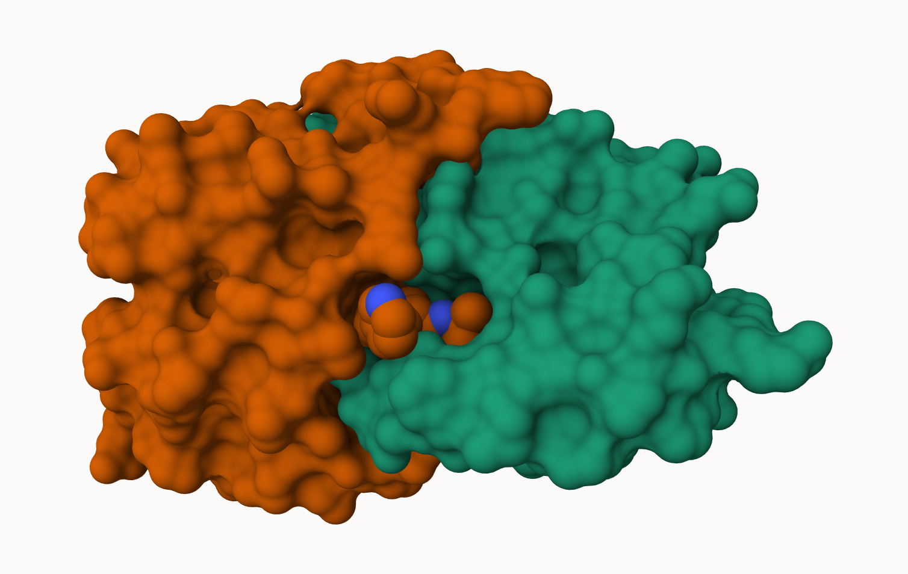
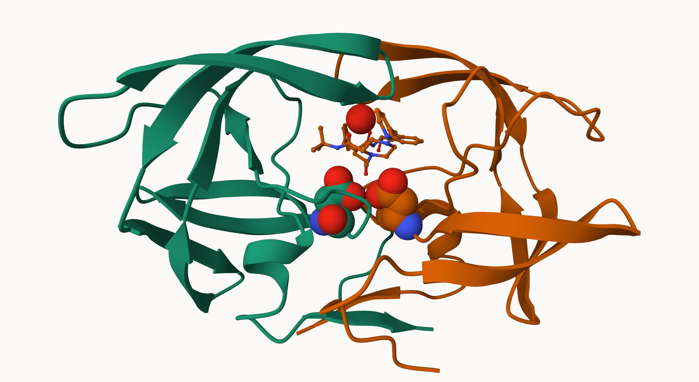
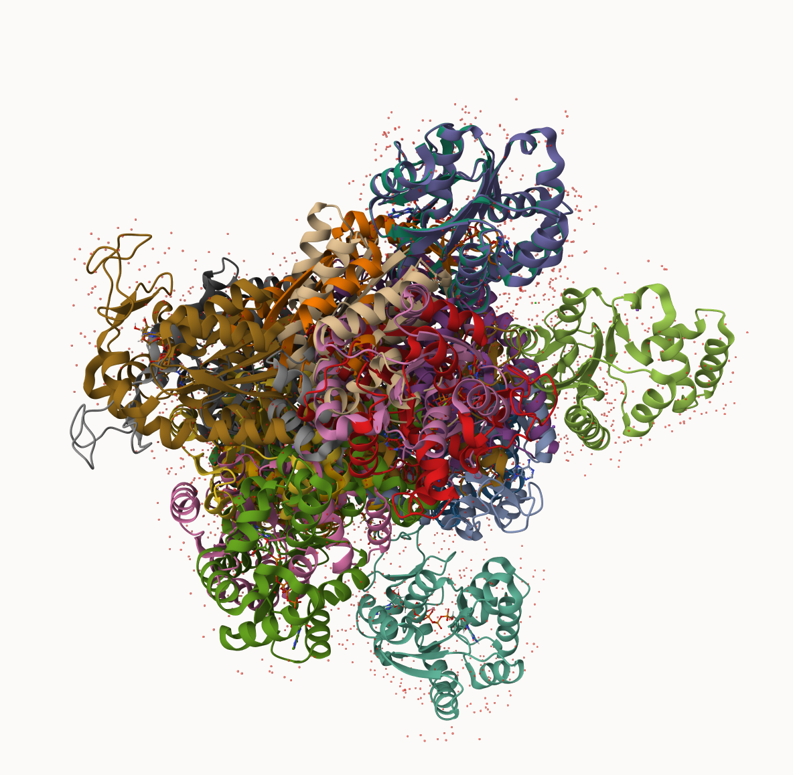

## Introduction to the RCSB Protein Data Bank (PDB)

The Protein Data Bank (PDB) is the main repository of biomolecular structures. Let's see what it contains:

```{r}
stats <- read.csv("Data Export Summary.csv")
stats
```

The comma in these numbers leads to the numbers here being read as characters.

### PDB Statistics

```{r}
library(readr)
stats <- read_csv("Data Export Summary.csv")
stats
```

> Q1: What percentage of structures in the PDB are solved by X-Ray and Electron Microscopy.

80.95% of the structures in the PDB are solved by X-Ray while 12.84% of the structures are solved by ELectron Microscopy.

```{r}
n.xray <- sum(stats$`X-ray`)
n.em <- sum(stats$EM)
n.total <- sum(stats$Total)

n.xray / n.total
n.em / n.total
```


> Q2: What proportion of structures in the PDB are protein?

97.91% of the structures in the PDB are proteins.

```{r}
sum(stats[1:3,"Total"]) / sum(stats$Total)
```


> Q3: Type HIV in the PDB website search box on the home page and determine how many HIV-1 protease structures are in the current PDB?

There are currently 1173 HIV-1 protease structures in the current PDB.

## Visualizing the HIV-1 Protease Structure

We can use the Molstar viewer online: https://molstar.org/viewer/


> Q4: Water molecules normally have 3 atoms. Why do we see just one atom per water molecule in this structure?


> Q5: There is a critical “conserved” water molecule in the binding site. Can you identify this water molecule? What residue number does this water molecule have


> Q6: Generate and save a figure clearly showing the two distinct chains of HIV-protease along with the ligand. You might also consider showing the catalytic residues ASP 25 in each chain and the critical water (we recommend “Ball & Stick” for these side-chains). Add this figure to your Quarto document.

A new clean image showing the catalytic ASP25 amino acids in both chains of the HIV-PR dimer along with the inhibitor and all important active site water.



> Q7: [Optional] As you have hopefully observed HIV protease is a homodimer (i.e. it is composed of two identical chains). With the aid of the graphic display can you identify secondary structure elements that are likely to only form in the dimer rather than the monomer?

## Bio3D Package for Structural Bioinformatics


```{r}
library(bio3d)

pdb <- read.pdb("1hsg")
pdb
```
> Q7: How many amino acid residues are there in this pdb object? 

There are 198 amino acid residues in the pdb oject

> Q8: Name one of the two non-protein residues? 

MK1 is one of the two non-protein residues

> Q9: How many protein chains are in this structure? 

There are 2 protein chains in this structure

```{r}
head(pdb$atom)
```

```{r}
library(bio3dview)
library(NGLVieweR)

# view.pdb(pdb) |>
  # setSpin()
```

```{r}
# Select the important ASP 25 residue
sele <- atom.select(pdb, resno=25)

# and highlight them in spacefill representation
# view.pdb(pdb, cols=c("navy","teal"), 
         # highlight = sele,
         # highlight.style = "spacefill") |>
  # setRock()
```


## Predicting Functional Motions of a Single Structure

```{r}
adk <- read.pdb("6s36")
adk
```

```{r}
# Perform flexibility prediction
m <- nma(adk)

plot(m)
```

Write out our results as a wee trajectory/movie of predicted motions:

```{r}
mktrj(m, file="adk_m7.pdb")
```

## Comparative Analysis with PCA

First step find an ADK sequence:

```{r}
library(bio3d)
id <- "1ake_A" ## Change this to run a different analysis
aa <- get.seq(id)
```

Next step, is search the PDB database for all related entries:

```{r}
blast <- blast.pdb(aa)
hits <- plot(blast)
```

All the BLAST results are here for us to see:
```{r}
head(blast$hit.tbl)
```

The "top hits" are in the `hits` object. Now we can download these to our computer. Put these in a wee sub-folder (directory) called "pdbs" and use gzip to speed things up

```{r}
# Download related PDB files
files <- get.pdb(hits$pdb.id, path="pdbs", split=TRUE, gzip=TRUE)
```

These look like a hot mess



Next we will use the `pdbaln()` function to align and also optionally fit (i.e. superpose) the identified PDB structures.

This requires a BioConductor package called "msa" that we need to install. First we install BiocManager. Then we use`BiocManager::install("msa")`

```{r}
# Align releated PDBs
pdbs <- pdbaln(files, fit = TRUE, exefile="msa")
```

Have a wee peek at this new "alignment object" `pdbs` 

```{r}
pdbs
```

We could view these in R with **bio3dview** `view.pdbs()` function.

```{r}
library(bio3dview)

view.pdbs(pdbs, colorScheme = "residue")
```

## PCA

We can run PCA on our `pdbs` object using the `pca()` function from **bio3d**:

```{r}
pc.xray <- pca(pdbs)
plot(pc.xray)
```

```{r}
plot(pc.xray, 1:2)
```

We can make a visualization of the major conformational difference (i.e. large scale structure change) captured by our PCA analysis with the `mktrj()` function.

```{r}
pc1 <- mktrj(pc.xray, file = "pca.pdb")
```

Let's see in Mol-star:


