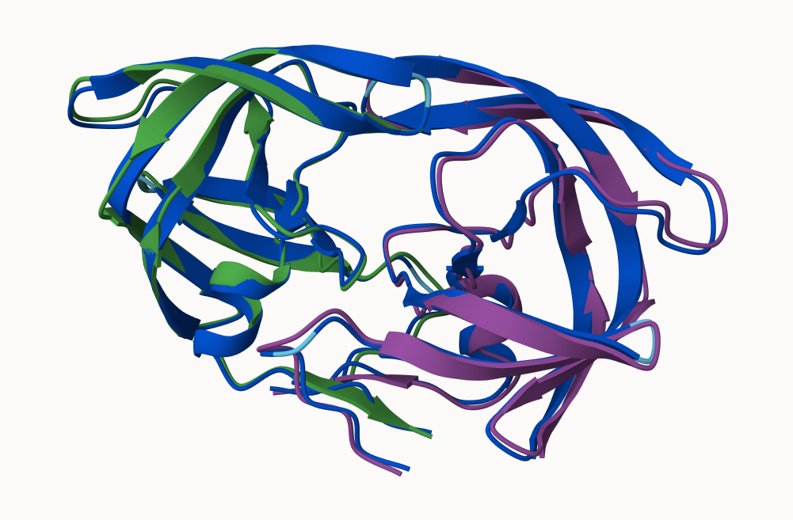
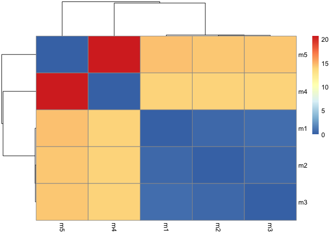
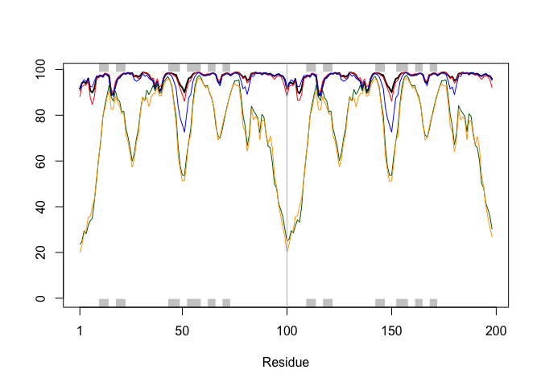
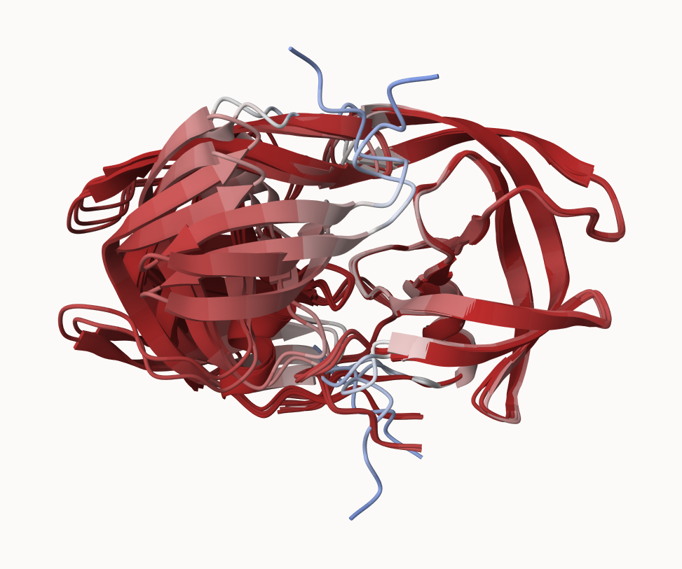
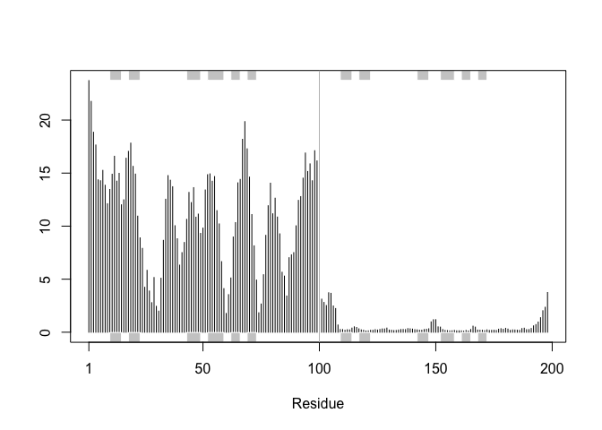
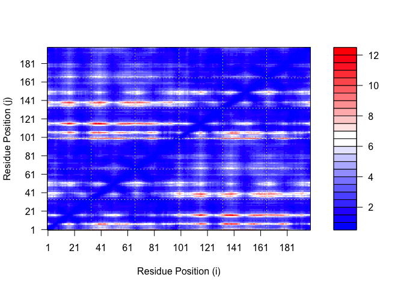
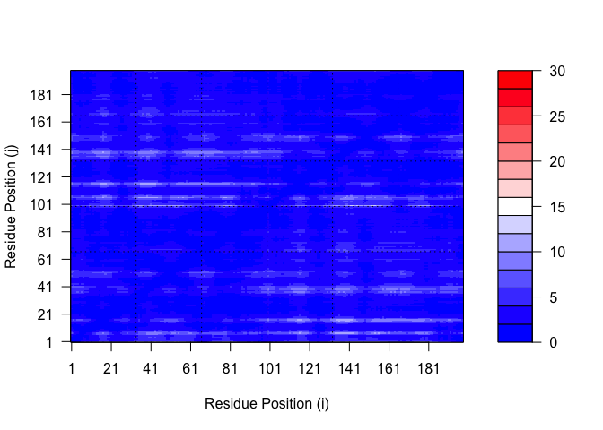
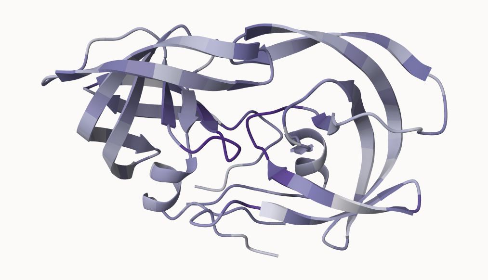

# Class 11
Brian Wong (PID: A186390010

- [Background](#background)
- [AlphaFold](#alphafold)
- [The EBI AlphaFold Database](#the-ebi-alphafold-database)
- [Running AlphaFold](#running-alphafold)
- [Interpreting Results](#interpreting-results)

## Background

We saw last day that the main repository for biomolecular structure (the
PDB database) only has ~250,000 entries.

UnitProtKB (the main protein sequence database) has over 200 million
entries!

## AlphaFold

In this hands-on session we will utilize AlphaFold to predict protein
structure from sequence (Jumper et al. 2021).

Without the aid of such approaches, it can take years of expensive
laboratory work to determine the structure of just one protein. With
AlphaFold we can now accurately compute a typical protein structure in
as little as ten minutes.

This major breakthrough (Figure 1) promises to place Molecular Biology
in a new era where we can visualize, analyze and interpret the
structures and functions of all proteins.

## The EBI AlphaFold Database

The EBI AlphaFold database contains lots of computed structure models.
It is increasingly likely that the strucutre you are interested in is
already in this database at \< https://alphafold.ebi.ac.uk/ \>

There are 3 major outputs from AlphaFold

1.  A model of structure in **PDB** format
2.  a **pLDDT** score: that tells us how confident the model is for a
    given residue in your protein (High values are good, above 70)
3.  a **PAE score** that tells us about protein packing quality

If you can’t find a matching entry for the sequence you are interested
in AFDB, you can run AlphaFold yourself…

## Running AlphaFold

We will use ColabFold to run AlphaFold on our sequence \<
https://colab.research.google.com/github/sokrypton/ColabFold/ \>

Figure from AlphaFold Here!



## Interpreting Results

Custom analysis of resulting models

We can read all the AlphaFold results in to R and do more quantitative
analysis than just viewing the structures in Mol-star:

Read all the PDB models:

``` r
library(bio3d)

# File names for all PDB models
pdb_files <- list.files("hivpr_23119/", pattern = ".pdb", full.names = TRUE)

# Print our PDB file names
basename(pdb_files)
```

    [1] "hivpr_23119_unrelaxed_rank_001_alphafold2_multimer_v3_model_4_seed_000.pdb"
    [2] "hivpr_23119_unrelaxed_rank_002_alphafold2_multimer_v3_model_1_seed_000.pdb"
    [3] "hivpr_23119_unrelaxed_rank_003_alphafold2_multimer_v3_model_5_seed_000.pdb"
    [4] "hivpr_23119_unrelaxed_rank_004_alphafold2_multimer_v3_model_2_seed_000.pdb"
    [5] "hivpr_23119_unrelaxed_rank_005_alphafold2_multimer_v3_model_3_seed_000.pdb"

``` r
# Read all data from Models 
#  and superpose/fit coords
pdbs <- pdbaln(pdb_files, fit=TRUE, exefile="msa")
```

    Reading PDB files:
    hivpr_23119//hivpr_23119_unrelaxed_rank_001_alphafold2_multimer_v3_model_4_seed_000.pdb
    hivpr_23119//hivpr_23119_unrelaxed_rank_002_alphafold2_multimer_v3_model_1_seed_000.pdb
    hivpr_23119//hivpr_23119_unrelaxed_rank_003_alphafold2_multimer_v3_model_5_seed_000.pdb
    hivpr_23119//hivpr_23119_unrelaxed_rank_004_alphafold2_multimer_v3_model_2_seed_000.pdb
    hivpr_23119//hivpr_23119_unrelaxed_rank_005_alphafold2_multimer_v3_model_3_seed_000.pdb
    .....

    Extracting sequences

    pdb/seq: 1   name: hivpr_23119//hivpr_23119_unrelaxed_rank_001_alphafold2_multimer_v3_model_4_seed_000.pdb 
    pdb/seq: 2   name: hivpr_23119//hivpr_23119_unrelaxed_rank_002_alphafold2_multimer_v3_model_1_seed_000.pdb 
    pdb/seq: 3   name: hivpr_23119//hivpr_23119_unrelaxed_rank_003_alphafold2_multimer_v3_model_5_seed_000.pdb 
    pdb/seq: 4   name: hivpr_23119//hivpr_23119_unrelaxed_rank_004_alphafold2_multimer_v3_model_2_seed_000.pdb 
    pdb/seq: 5   name: hivpr_23119//hivpr_23119_unrelaxed_rank_005_alphafold2_multimer_v3_model_3_seed_000.pdb 

``` r
# library(bio3dview)
# view.pdbs(pdbs)
```

How similar or different are my models?

``` r
rd <- rmsd(pdbs)
```

    Warning in rmsd(pdbs): No indices provided, using the 198 non NA positions

``` r
library(pheatmap)

colnames(rd) <- paste0("m",1:5)
rownames(rd) <- paste0("m",1:5)
pheatmap(rd)
```



Now lets plot the pLDDT values across all models.

``` r
# Read a reference PDB structure
pdb <- read.pdb("1hsg")
```

      Note: Accessing on-line PDB file

``` r
plotb3(pdbs$b[1,], typ="l", lwd=2, sse=pdb)
points(pdbs$b[2,], typ="l", col="red")
points(pdbs$b[3,], typ="l", col="blue")
points(pdbs$b[4,], typ="l", col="darkgreen")
points(pdbs$b[5,], typ="l", col="orange")
abline(v=100, col="gray")
```



We can improve the superposition/fitting of our models by finding the
most consistent “rigid core” common across all the models. For this we
will use the `core.find()` function:

``` r
core <- core.find(pdbs)
```

     core size 197 of 198  vol = 5310.035 
     core size 196 of 198  vol = 4635.834 
     core size 195 of 198  vol = 1812.524 
     core size 194 of 198  vol = 1109.016 
     core size 193 of 198  vol = 1035.296 
     core size 192 of 198  vol = 986.96 
     core size 191 of 198  vol = 941.365 
     core size 190 of 198  vol = 898.466 
     core size 189 of 198  vol = 857.922 
     core size 188 of 198  vol = 824.025 
     core size 187 of 198  vol = 793.081 
     core size 186 of 198  vol = 763.85 
     core size 185 of 198  vol = 740.429 
     core size 184 of 198  vol = 700.174 
     core size 183 of 198  vol = 673.821 
     core size 182 of 198  vol = 652.067 
     core size 181 of 198  vol = 634.066 
     core size 180 of 198  vol = 616.025 
     core size 179 of 198  vol = 599.771 
     core size 178 of 198  vol = 583.741 
     core size 177 of 198  vol = 568.863 
     core size 176 of 198  vol = 554.38 
     core size 175 of 198  vol = 536.073 
     core size 174 of 198  vol = 524.642 
     core size 173 of 198  vol = 510.527 
     core size 172 of 198  vol = 482.586 
     core size 171 of 198  vol = 464.833 
     core size 170 of 198  vol = 451.199 
     core size 169 of 198  vol = 435.724 
     core size 168 of 198  vol = 422.476 
     core size 167 of 198  vol = 412.705 
     core size 166 of 198  vol = 400.321 
     core size 165 of 198  vol = 389.367 
     core size 164 of 198  vol = 375.984 
     core size 163 of 198  vol = 364.58 
     core size 162 of 198  vol = 350.368 
     core size 161 of 198  vol = 338.444 
     core size 160 of 198  vol = 326.536 
     core size 159 of 198  vol = 315.655 
     core size 158 of 198  vol = 303.764 
     core size 157 of 198  vol = 292.94 
     core size 156 of 198  vol = 281.907 
     core size 155 of 198  vol = 272.908 
     core size 154 of 198  vol = 263.955 
     core size 153 of 198  vol = 254.522 
     core size 152 of 198  vol = 245.239 
     core size 151 of 198  vol = 231.669 
     core size 150 of 198  vol = 219.592 
     core size 149 of 198  vol = 211.974 
     core size 148 of 198  vol = 204.299 
     core size 147 of 198  vol = 194.165 
     core size 146 of 198  vol = 186.442 
     core size 145 of 198  vol = 178.703 
     core size 144 of 198  vol = 170.526 
     core size 143 of 198  vol = 163.019 
     core size 142 of 198  vol = 152.8 
     core size 141 of 198  vol = 143.077 
     core size 140 of 198  vol = 137.043 
     core size 139 of 198  vol = 131.686 
     core size 138 of 198  vol = 124.269 
     core size 137 of 198  vol = 117.206 
     core size 136 of 198  vol = 111.441 
     core size 135 of 198  vol = 104.8 
     core size 134 of 198  vol = 98.704 
     core size 133 of 198  vol = 94.662 
     core size 132 of 198  vol = 90.487 
     core size 131 of 198  vol = 87.458 
     core size 130 of 198  vol = 83.811 
     core size 129 of 198  vol = 79.337 
     core size 128 of 198  vol = 75.465 
     core size 127 of 198  vol = 71.717 
     core size 126 of 198  vol = 68.457 
     core size 125 of 198  vol = 64.79 
     core size 124 of 198  vol = 62.058 
     core size 123 of 198  vol = 58.244 
     core size 122 of 198  vol = 54.043 
     core size 121 of 198  vol = 49.43 
     core size 120 of 198  vol = 46.72 
     core size 119 of 198  vol = 43.468 
     core size 118 of 198  vol = 40 
     core size 117 of 198  vol = 37.229 
     core size 116 of 198  vol = 34.353 
     core size 115 of 198  vol = 31.473 
     core size 114 of 198  vol = 28.779 
     core size 113 of 198  vol = 26.188 
     core size 112 of 198  vol = 24.174 
     core size 111 of 198  vol = 22.314 
     core size 110 of 198  vol = 20.553 
     core size 109 of 198  vol = 18.935 
     core size 108 of 198  vol = 17.265 
     core size 107 of 198  vol = 15.517 
     core size 106 of 198  vol = 13.676 
     core size 105 of 198  vol = 12.402 
     core size 104 of 198  vol = 11.182 
     core size 103 of 198  vol = 10.242 
     core size 102 of 198  vol = 8.928 
     core size 101 of 198  vol = 8.18 
     core size 100 of 198  vol = 7.219 
     core size 99 of 198  vol = 6.1 
     core size 98 of 198  vol = 5.264 
     core size 97 of 198  vol = 4.359 
     core size 96 of 198  vol = 3.772 
     core size 95 of 198  vol = 3.183 
     core size 94 of 198  vol = 2.696 
     core size 93 of 198  vol = 2.414 
     core size 92 of 198  vol = 1.876 
     core size 91 of 198  vol = 1.611 
     core size 90 of 198  vol = 1.272 
     core size 89 of 198  vol = 1.038 
     core size 88 of 198  vol = 0.857 
     core size 87 of 198  vol = 0.686 
     core size 86 of 198  vol = 0.54 
     core size 85 of 198  vol = 0.44 
     FINISHED: Min vol ( 0.5 ) reached

``` r
# We can now use the identified core atom positions as a basis for a more suitable superposition and write out the fitted structures to a directory called corefit_structures
core.inds <- print(core, vol=0.5)
```

    # 86 positions (cumulative volume <= 0.5 Angstrom^3) 
      start end length
    1     9  50     42
    2    52  95     44

``` r
xyz <- pdbfit(pdbs, core.inds, outpath="corefit_structures")
```



Now we can examine the RMSF between positions of the structure. RMSF is
an often used measure of conformational variance along the structure:

``` r
rf <- rmsf(xyz)

plotb3(rf, sse=pdb)
abline(v=100, col="gray", ylab="RMSF")
```



Predicted Alignment Error for Domains (PAE):

``` r
library(jsonlite)

# Listing of all PAE JSON files
pae_files <- list.files("hivpr_23119/",
                        pattern=".*model.*\\.json",
                        full.names = TRUE)
```

``` r
pae1 <- read_json(pae_files[1],simplifyVector = TRUE)
pae5 <- read_json(pae_files[5],simplifyVector = TRUE)

attributes(pae1)
```

    $names
    [1] "plddt"   "max_pae" "pae"     "ptm"     "iptm"   

``` r
# Per-residue pLDDT scores 
#  same as B-factor of PDB..
head(pae1$plddt) 
```

    [1] 91.62 94.06 94.56 93.88 96.12 90.69

The maximum PAE values are useful for ranking models. Here we can see
that model 5 is much worse than model 1. The lower the PAE score the
better. How about the other models, what are thir max PAE scores?

``` r
pae1$max_pae
```

    [1] 12.33594

``` r
pae5$max_pae
```

    [1] 29.45312

We can plot the N by N (where N is the number of residues) PAE scores
with ggplot or with functions from the Bio3D package:

``` r
plot.dmat(pae1$pae, 
          xlab="Residue Position (i)",
          ylab="Residue Position (j)")
```



``` r
plot.dmat(pae5$pae, 
          xlab="Residue Position (i)",
          ylab="Residue Position (j)",
          grid.col = "black",
          zlim=c(0,30))
```


We should really plot all of these using the same z range. Here is the
model 1 plot again but this time using the same data range as the plot
for model 5:

``` r
plot.dmat(pae1$pae, 
          xlab="Residue Position (i)",
          ylab="Residue Position (j)",
          grid.col = "black",
          zlim=c(0,30))
```



Residue Conservation from Alignment File

``` r
aln_file <- list.files("hivpr_23119/",
                       pattern=".a3m$",
                        full.names = TRUE)
aln_file
```

    [1] "hivpr_23119//hivpr_23119.a3m"

``` r
aln <- read.fasta(aln_file[1], to.upper = TRUE)
```

    [1] " ** Duplicated sequence id's: 101 **"
    [2] " ** Duplicated sequence id's: 101 **"

``` r
dim(aln$ali)
```

    [1] 5397  132

We can score residue conservation in the alignment with the `conserv()`
function.

``` r
sim <- conserv(aln)
```

``` r
plotb3(sim[1:99], sse=trim.pdb(pdb, chain="A"),
       ylab="Conservation Score")
```


``` r
con <- consensus(aln, cutoff = 0.9)
con$seq
```

      [1] "-" "-" "-" "-" "-" "-" "-" "-" "-" "-" "-" "-" "-" "-" "-" "-" "-" "-"
     [19] "-" "-" "-" "-" "-" "-" "D" "T" "G" "A" "-" "-" "-" "-" "-" "-" "-" "-"
     [37] "-" "-" "-" "-" "-" "-" "-" "-" "-" "-" "-" "-" "-" "-" "-" "-" "-" "-"
     [55] "-" "-" "-" "-" "-" "-" "-" "-" "-" "-" "-" "-" "-" "-" "-" "-" "-" "-"
     [73] "-" "-" "-" "-" "-" "-" "-" "-" "-" "-" "-" "-" "-" "-" "-" "-" "-" "-"
     [91] "-" "-" "-" "-" "-" "-" "-" "-" "-" "-" "-" "-" "-" "-" "-" "-" "-" "-"
    [109] "-" "-" "-" "-" "-" "-" "-" "-" "-" "-" "-" "-" "-" "-" "-" "-" "-" "-"
    [127] "-" "-" "-" "-" "-" "-"

``` r
m1.pdb <- read.pdb(pdb_files[1])
occ <- vec2resno(c(sim[1:99], sim[1:99]), m1.pdb$atom$resno)
write.pdb(m1.pdb, o=occ, file="m1_conserv.pdb")
```


