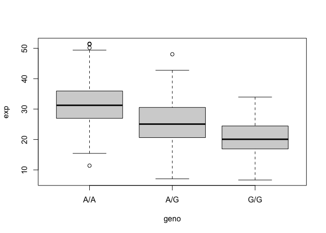

# Class 12: Genome Informatics
Brian Wong (PID: A18639001)

## Background

This class introduces the fundamentals of genome informatics and high
throughput sequencing. The lab itself focuses on the Galaxy platform and
RNA-Sequencing methods for gene expression analysis.

## Section 4: Population Scale Analysis \[HOMEWORK\]

One sample is obviously not enough to know what is happening in a
population. You are interested in assessing genetic differences on a
population scale. So, you processed about ~230 samples and did the
normalization on a genome level. Now, you want to find whether there is
any association of the 4 asthma-associated SNPs (rs8067378…) on ORMDL3
expression.

> Q13: Read this file into R and determine the sample size for each
> genotype and their corresponding median expression levels for each of
> these genotypes.

``` r
expr <- read.table("rs8067378_ENSG00000172057.6.txt")
head(expr)
```

       sample geno      exp
    1 HG00367  A/G 28.96038
    2 NA20768  A/G 20.24449
    3 HG00361  A/A 31.32628
    4 HG00135  A/A 34.11169
    5 NA18870  G/G 18.25141
    6 NA11993  A/A 32.89721

The sample size for each genotype is here below:

``` r
table(expr$geno)
```


    A/A A/G G/G 
    108 233 121 

The median expression levels for each of the genotypes are here below:

``` r
summary(expr$exp[expr$geno == "A/A"])
```

       Min. 1st Qu.  Median    Mean 3rd Qu.    Max. 
      11.40   27.02   31.25   31.82   35.92   51.52 

``` r
summary(expr$exp[expr$geno == "A/G"])
```

       Min. 1st Qu.  Median    Mean 3rd Qu.    Max. 
      7.075  20.626  25.065  25.397  30.552  48.034 

``` r
summary(expr$exp[expr$geno == "G/G"])
```

       Min. 1st Qu.  Median    Mean 3rd Qu.    Max. 
      6.675  16.903  20.074  20.594  24.457  33.956 

``` r
bp <- boxplot(exp ~ geno, expr)
```



``` r
bp$stats[3,]
```

    [1] 31.24847 25.06486 20.07363

A/A = 31.24847, A/G = 25.06486, G/G = 20.07363

> Q14: Generate a boxplot with a box per genotype, what could you infer
> from the relative expression value between A/A and G/G displayed in
> this plot? Does the SNP affect the expression of ORMDL3?

It can be inferred that the relative expression value between A/A and
G/G are quite different, with G/G being having a reduced relative
expression level compared to A/A. Therefore, it can be inferred that the
SNP does affect the expression of ORMDL3 based on this boxplot.

``` r
library(ggplot2)
ggplot(expr) + aes(geno, exp, fill = geno) + geom_boxplot(notch = TRUE)
```


