# Class 18: Pertussis Mini Project
Brian Wong (PID: A18639001)

- [Background](#background)
- [CDC Tracking Data](#cdc-tracking-data)
  - [Exploring CMI-PB Data](#exploring-cmi-pb-data)
  - [Obtaining CMI-PB RNASeq Data](#obtaining-cmi-pb-rnaseq-data)

## Background

Pertussis (whooping cough) is a common lung infection caused by the
bacteria B. Pertussis. It can infect anyone but is most deadly for
infants (under 1 year of age).

# CDC Tracking Data

The CDC tracks the number of of Pertussis cases:

> Q1. With the help of the R “addin” package datapasta assign the CDC
> pertussis case number data to a data frame called cdc and use ggplot
> to make a plot of cases numbers over time.

> [!NOTE]
>
> ``` r
> cdc <- data.frame(
>   year = c(1922L,1923L,1924L,1925L,
>            1926L,1927L,1928L,1929L,1930L,1931L,
>            1932L,1933L,1934L,1935L,1936L,
>            1937L,1938L,1939L,1940L,1941L,1942L,
>            1943L,1944L,1945L,1946L,1947L,
>            1948L,1949L,1950L,1951L,1952L,
>            1953L,1954L,1955L,1956L,1957L,1958L,
>            1959L,1960L,1961L,1962L,1963L,
>            1964L,1965L,1966L,1967L,1968L,1969L,
>            1970L,1971L,1972L,1973L,1974L,
>            1975L,1976L,1977L,1978L,1979L,1980L,
>            1981L,1982L,1983L,1984L,1985L,
>            1986L,1987L,1988L,1989L,1990L,
>            1991L,1992L,1993L,1994L,1995L,1996L,
>            1997L,1998L,1999L,2000L,2001L,
>            2002L,2003L,2004L,2005L,2006L,2007L,
>            2008L,2009L,2010L,2011L,2012L,
>            2013L,2014L,2015L,2016L,2017L,2018L,
>            2019L,2020L,2021L,2022L,2023L,2024L, 2025L),
>   cases = c(107473,164191,165418,152003,
>             202210,181411,161799,197371,
>             166914,172559,215343,179135,265269,
>             180518,147237,214652,227319,103188,
>             183866,222202,191383,191890,109873,
>             133792,109860,156517,74715,69479,
>             120718,68687,45030,37129,60886,
>             62786,31732,28295,32148,40005,
>             14809,11468,17749,17135,13005,6799,
>             7717,9718,4810,3285,4249,3036,
>             3287,1759,2402,1738,1010,2177,2063,
>             1623,1730,1248,1895,2463,2276,
>             3589,4195,2823,3450,4157,4570,
>             2719,4083,6586,4617,5137,7796,6564,
>             7405,7298,7867,7580,9771,11647,
>             25827,25616,15632,10454,13278,
>             16858,27550,18719,48277,28639,32971,
>             20762,17972,18975,15609,18617,
>             6124,2116,3044,7063,22538,21996)
> )
> ```

``` r
library(ggplot2)

ggplot(cdc) + 
  aes(year, cases) + 
  geom_point() + 
  geom_line() + 
  labs(x = "Year", y = "Number of cases", title = "Pertussis Cases by Year (1922 - 2025)")
```

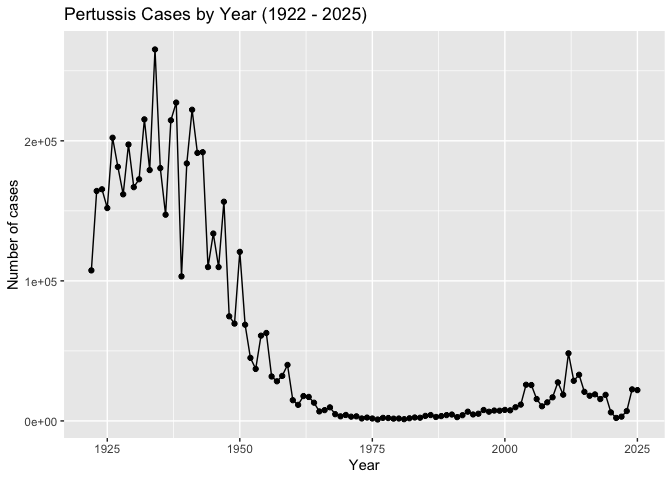

> Q2. Using the ggplot geom_vline() function add lines to your previous
> plot for the 1946 introduction of the wP vaccine and the 1996 switch
> to aP vaccine (see example in the hint below). What do you notice?

> Q. Add annotation lines for the major milestones of wP vaccination
> roll-out (1946) and the switch to the aP vaccine (1996).

``` r
ggplot(cdc) + 
  aes(year, cases) + 
  geom_point() + 
  geom_line() + 
  labs(x = "Year", y = "Number of cases", 
       title = "Pertussis Cases by Year (1922 - 2025)") +
  geom_vline(xintercept = 1946, col = "blue", lty = 2) + 
  geom_vline(xintercept = 1996, col = "red", lty = 2) + 
  geom_vline(xintercept = 2020, col = "gray", lty = 2)
```

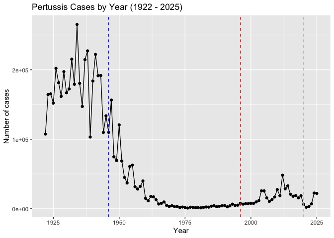

> Q3. Describe what happened after the introduction of the aP vaccine?
> Do you have a possible explanation for the observed trend?

After the introduction of the aP vaccine, the number of cases of
Pertussis decreased a significant amount. Making the aP vaccine safer
and more effective with less side effects than the wP vaccine could have
caused less cases and people to be more confident in the vaccine. After
a while, it seems like the number of cases started to rise again, which
could be due to how the weakening of the aP vaccine with less side
effects and an increased number of testing.

## Exploring CMI-PB Data

The CMI-PB project’s \< https://www.cmi-pb.org/ \> is to provide the
scientific community with a comprehensive, high-quality and freely
accessible resource of Pertussis booster vaccination.

Basically, they make available a large dataset on the immune response to
Pertussis. They use a “booster” vaccination as a proxy for Pertussis
infection.

They make their data available as a JSON format API. We can read this
into R with the `read_json()` function from the **jsonlite** package:

``` r
library(jsonlite)
subject <- read_json("https://www.cmi-pb.org/api/v5_1/subject", 
                     simplifyVector = TRUE)
head(subject)
```

      subject_id infancy_vac biological_sex              ethnicity  race
    1          1          wP         Female Not Hispanic or Latino White
    2          2          wP         Female Not Hispanic or Latino White
    3          3          wP         Female                Unknown White
    4          4          wP           Male Not Hispanic or Latino Asian
    5          5          wP           Male Not Hispanic or Latino Asian
    6          6          wP         Female Not Hispanic or Latino White
      year_of_birth date_of_boost      dataset
    1    1986-01-01    2016-09-12 2020_dataset
    2    1968-01-01    2019-01-28 2020_dataset
    3    1983-01-01    2016-10-10 2020_dataset
    4    1988-01-01    2016-08-29 2020_dataset
    5    1991-01-01    2016-08-29 2020_dataset
    6    1988-01-01    2016-10-10 2020_dataset

> Q4. How many aP and wP infancy vaccinated subjects are in the dataset?

> How many aP and wP individual are there in this `subject` table?

``` r
table(subject$infancy_vac)
```


    aP wP 
    87 85 

> Q5. How many Male and Female subjects/patients are in the dataset?

``` r
table(subject$biological_sex)
```


    Female   Male 
       112     60 

> Q6. What is the breakdown of race and biological sex (e.g. number of
> Asian females, White males etc…)?

``` r
table(subject$race, subject$biological_sex)
```

                                               
                                                Female Male
      American Indian/Alaska Native                  0    1
      Asian                                         32   12
      Black or African American                      2    3
      More Than One Race                            15    4
      Native Hawaiian or Other Pacific Islander      1    1
      Unknown or Not Reported                       14    7
      White                                         48   32

> Q. Is this representative of the US population?

No, this is not representative of the US population.

Working with Dates:

``` r
library(lubridate)
```


    Attaching package: 'lubridate'

    The following objects are masked from 'package:base':

        date, intersect, setdiff, union

``` r
today()
```

    [1] "2026-03-12"

``` r
today() - ymd("2000-01-01")
```

    Time difference of 9567 days

``` r
time_length( today() - ymd("2000-01-01"),  "years")
```

    [1] 26.19302

> Q7. Using this approach determine (i) the average age of wP
> individuals, (ii) the average age of aP individuals; and (iii) are
> they significantly different?

``` r
library(dplyr)
```


    Attaching package: 'dplyr'

    The following objects are masked from 'package:stats':

        filter, lag

    The following objects are masked from 'package:base':

        intersect, setdiff, setequal, union

``` r
subject$age <- today() - ymd(subject$year_of_birth)

ap <- subject |> filter(infancy_vac == "aP")

round( summary( time_length( ap$age, "years" ) ) )
```

       Min. 1st Qu.  Median    Mean 3rd Qu.    Max. 
         23      27      28      28      29      35 

``` r
wp <- subject %>% filter(infancy_vac == "wP")
round( summary( time_length( wp$age, "years" ) ) )
```

       Min. 1st Qu.  Median    Mean 3rd Qu.    Max. 
         23      33      35      37      40      58 

``` r
t.test(ap$age, wp$age)
```


        Welch Two Sample t-test

    data:  ap$age and wp$age
    t = -12.918 days, df = 104.03, p-value < 2.2e-16
    alternative hypothesis: true difference in means is not equal to 0
    95 percent confidence interval:
     -3686.855 days -2705.535 days
    sample estimates:
    Time differences in days
    mean of x mean of y 
     10259.28  13455.47 

> Q8. Determine the age of all individuals at time of boost?

``` r
int <- ymd(subject$date_of_boost) - ymd(subject$year_of_birth)
age_at_boost <- time_length(int, "year")
head(age_at_boost)
```

    [1] 30.69678 51.07461 33.77413 28.65982 25.65914 28.77481

> Q9. With the help of a faceted boxplot or histogram (see below), do
> you think these two groups are significantly different?

Yes, these two groups are significantly different.

``` r
ggplot(subject) +
  aes(time_length(age, "year"),
      fill=as.factor(infancy_vac)) +
  geom_histogram(show.legend=FALSE) +
  facet_wrap(vars(infancy_vac), nrow=2) +
  xlab("Age in years")
```

    `stat_bin()` using `bins = 30`. Pick better value with `binwidth`.

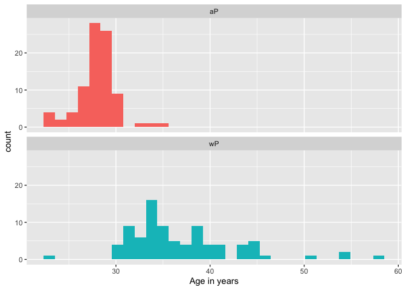

``` r
x <- t.test(time_length( wp$age, "years" ),
       time_length( ap$age, "years" ))

x$p.value
```

    [1] 2.372101e-23

We can read more tables from the CMI-PB database

``` r
specimen <- read_json("https://www.cmi-pb.org/api/v5_1/specimen",
                      simplifyVector = TRUE)
ab_titer <- read_json("https://www.cmi-pb.org/api/v5_1/plasma_ab_titer",
                      simplifyVector = TRUE)
```

``` r
head(specimen)
```

      specimen_id subject_id actual_day_relative_to_boost
    1           1          1                           -3
    2           2          1                            1
    3           3          1                            3
    4           4          1                            7
    5           5          1                           11
    6           6          1                           32
      planned_day_relative_to_boost specimen_type visit
    1                             0         Blood     1
    2                             1         Blood     2
    3                             3         Blood     3
    4                             7         Blood     4
    5                            14         Blood     5
    6                            30         Blood     6

``` r
head(ab_titer)
```

      specimen_id isotype is_antigen_specific antigen        MFI MFI_normalised
    1           1     IgE               FALSE   Total 1110.21154       2.493425
    2           1     IgE               FALSE   Total 2708.91616       2.493425
    3           1     IgG                TRUE      PT   68.56614       3.736992
    4           1     IgG                TRUE     PRN  332.12718       2.602350
    5           1     IgG                TRUE     FHA 1887.12263      34.050956
    6           1     IgE                TRUE     ACT    0.10000       1.000000
       unit lower_limit_of_detection
    1 UG/ML                 2.096133
    2 IU/ML                29.170000
    3 IU/ML                 0.530000
    4 IU/ML                 6.205949
    5 IU/ML                 4.679535
    6 IU/ML                 2.816431

To make sense of all this data, we need to “join” (a.k.a. merge or
“link”) all of these tables together. Only then will you know that a
given Ab measurement (from the `ab_titer` table) was collected on a
certain date (from the `specimen` table) from a certain wP or aP subject
(from the `subject` table).

We can use **dplyr** and the `*.join()` family of functions to do this.

> Q9. Complete the code to join specimen and subject tables to make a
> new merged data frame containing all specimen records along with their
> associated subject details:

``` r
library(dplyr)
meta <- inner_join(subject, specimen)
```

    Joining with `by = join_by(subject_id)`

``` r
dim(meta)
```

    [1] 1503   14

``` r
head(meta)
```

      subject_id infancy_vac biological_sex              ethnicity  race
    1          1          wP         Female Not Hispanic or Latino White
    2          1          wP         Female Not Hispanic or Latino White
    3          1          wP         Female Not Hispanic or Latino White
    4          1          wP         Female Not Hispanic or Latino White
    5          1          wP         Female Not Hispanic or Latino White
    6          1          wP         Female Not Hispanic or Latino White
      year_of_birth date_of_boost      dataset        age specimen_id
    1    1986-01-01    2016-09-12 2020_dataset 14680 days           1
    2    1986-01-01    2016-09-12 2020_dataset 14680 days           2
    3    1986-01-01    2016-09-12 2020_dataset 14680 days           3
    4    1986-01-01    2016-09-12 2020_dataset 14680 days           4
    5    1986-01-01    2016-09-12 2020_dataset 14680 days           5
    6    1986-01-01    2016-09-12 2020_dataset 14680 days           6
      actual_day_relative_to_boost planned_day_relative_to_boost specimen_type
    1                           -3                             0         Blood
    2                            1                             1         Blood
    3                            3                             3         Blood
    4                            7                             7         Blood
    5                           11                            14         Blood
    6                           32                            30         Blood
      visit
    1     1
    2     2
    3     3
    4     4
    5     5
    6     6

> Q10. Now using the same procedure join meta with titer data so we can
> further analyze this data in terms of time of visit aP/wP, male/female
> etc.

Let’s do one more `inner_join()` to join the `ab_titer` with all our
`meta` data.

``` r
abdata <- inner_join(ab_titer, meta)
```

    Joining with `by = join_by(specimen_id)`

``` r
head(abdata)
```

      specimen_id isotype is_antigen_specific antigen        MFI MFI_normalised
    1           1     IgE               FALSE   Total 1110.21154       2.493425
    2           1     IgE               FALSE   Total 2708.91616       2.493425
    3           1     IgG                TRUE      PT   68.56614       3.736992
    4           1     IgG                TRUE     PRN  332.12718       2.602350
    5           1     IgG                TRUE     FHA 1887.12263      34.050956
    6           1     IgE                TRUE     ACT    0.10000       1.000000
       unit lower_limit_of_detection subject_id infancy_vac biological_sex
    1 UG/ML                 2.096133          1          wP         Female
    2 IU/ML                29.170000          1          wP         Female
    3 IU/ML                 0.530000          1          wP         Female
    4 IU/ML                 6.205949          1          wP         Female
    5 IU/ML                 4.679535          1          wP         Female
    6 IU/ML                 2.816431          1          wP         Female
                   ethnicity  race year_of_birth date_of_boost      dataset
    1 Not Hispanic or Latino White    1986-01-01    2016-09-12 2020_dataset
    2 Not Hispanic or Latino White    1986-01-01    2016-09-12 2020_dataset
    3 Not Hispanic or Latino White    1986-01-01    2016-09-12 2020_dataset
    4 Not Hispanic or Latino White    1986-01-01    2016-09-12 2020_dataset
    5 Not Hispanic or Latino White    1986-01-01    2016-09-12 2020_dataset
    6 Not Hispanic or Latino White    1986-01-01    2016-09-12 2020_dataset
             age actual_day_relative_to_boost planned_day_relative_to_boost
    1 14680 days                           -3                             0
    2 14680 days                           -3                             0
    3 14680 days                           -3                             0
    4 14680 days                           -3                             0
    5 14680 days                           -3                             0
    6 14680 days                           -3                             0
      specimen_type visit
    1         Blood     1
    2         Blood     1
    3         Blood     1
    4         Blood     1
    5         Blood     1
    6         Blood     1

> Q11. How many different Ab “isotypes” values are in this dataset?

``` r
table(abdata$isotype)
```


      IgE   IgG  IgG1  IgG2  IgG3  IgG4 
     6698  7265 11993 12000 12000 12000 

> Q12. How many different “antigen” values are measured?

``` r
table(abdata$antigen)
```


        ACT   BETV1      DT   FELD1     FHA  FIM2/3   LOLP1     LOS Measles     OVA 
       1970    1970    6318    1970    6712    6318    1970    1970    1970    6318 
        PD1     PRN      PT     PTM   Total      TT 
       1970    6712    6712    1970     788    6318 

Let’s focus on IgG isotype

``` r
igg <- abdata |> filter(isotype == "IgG")

head(igg)
```

      specimen_id isotype is_antigen_specific antigen        MFI MFI_normalised
    1           1     IgG                TRUE      PT   68.56614       3.736992
    2           1     IgG                TRUE     PRN  332.12718       2.602350
    3           1     IgG                TRUE     FHA 1887.12263      34.050956
    4          19     IgG                TRUE      PT   20.11607       1.096366
    5          19     IgG                TRUE     PRN  976.67419       7.652635
    6          19     IgG                TRUE     FHA   60.76626       1.096457
       unit lower_limit_of_detection subject_id infancy_vac biological_sex
    1 IU/ML                 0.530000          1          wP         Female
    2 IU/ML                 6.205949          1          wP         Female
    3 IU/ML                 4.679535          1          wP         Female
    4 IU/ML                 0.530000          3          wP         Female
    5 IU/ML                 6.205949          3          wP         Female
    6 IU/ML                 4.679535          3          wP         Female
                   ethnicity  race year_of_birth date_of_boost      dataset
    1 Not Hispanic or Latino White    1986-01-01    2016-09-12 2020_dataset
    2 Not Hispanic or Latino White    1986-01-01    2016-09-12 2020_dataset
    3 Not Hispanic or Latino White    1986-01-01    2016-09-12 2020_dataset
    4                Unknown White    1983-01-01    2016-10-10 2020_dataset
    5                Unknown White    1983-01-01    2016-10-10 2020_dataset
    6                Unknown White    1983-01-01    2016-10-10 2020_dataset
             age actual_day_relative_to_boost planned_day_relative_to_boost
    1 14680 days                           -3                             0
    2 14680 days                           -3                             0
    3 14680 days                           -3                             0
    4 15776 days                           -3                             0
    5 15776 days                           -3                             0
    6 15776 days                           -3                             0
      specimen_type visit
    1         Blood     1
    2         Blood     1
    3         Blood     1
    4         Blood     1
    5         Blood     1
    6         Blood     1

Let’s make a plot of `MFI_normalised` values for all `antigen` values.

``` r
ggplot(igg) +
  aes(MFI_normalised, antigen) + 
  geom_boxplot()
```


The antigens “PT”, “FIM2/3”, and “FHA” appear to have the widest range
of values.

> Q13. Complete the following code to make a summary boxplot of Ab titer
> levels (MFI) for all antigens:

``` r
ggplot(igg) +
  aes(MFI_normalised, antigen) +
  geom_boxplot() + 
    xlim(0,75) +
  facet_wrap(vars(visit), nrow=2)
```

    Warning: Removed 5 rows containing non-finite outside the scale range
    (`stat_boxplot()`).

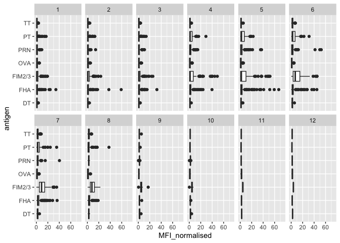

> Q14. Is there a difference for these responses between aP and wP
> individuals?

The antigens “PT”, “FIM2/3”, and “FHA” appear to have the widest range
of values.

``` r
ggplot(igg) +
  aes(MFI_normalised, antigen, col=infancy_vac) + 
  geom_boxplot()
```

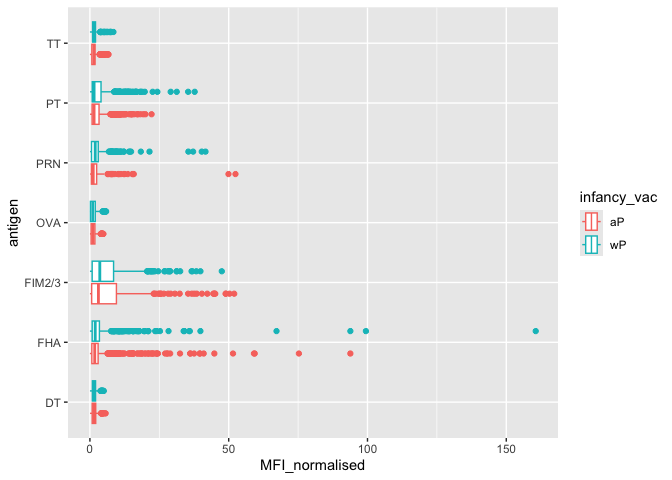

``` r
ggplot(igg) +
  aes(MFI_normalised, antigen, col=infancy_vac ) +
  geom_boxplot(show.legend = FALSE) + 
  facet_wrap(vars(visit), nrow=2) +
  xlim(0,75) +
  theme_bw()
```

    Warning: Removed 5 rows containing non-finite outside the scale range
    (`stat_boxplot()`).

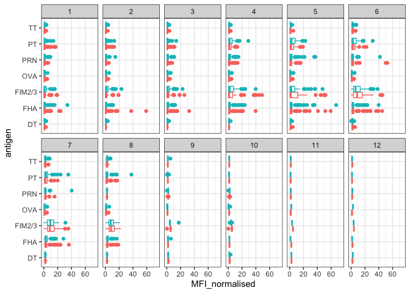

``` r
igg %>% filter(visit != 8) %>%
ggplot() +
  aes(MFI_normalised, antigen, col=infancy_vac ) +
  geom_boxplot(show.legend = FALSE) + 
  xlim(0,75) +
  facet_wrap(vars(infancy_vac, visit), nrow=2)
```

    Warning: Removed 5 rows containing non-finite outside the scale range
    (`stat_boxplot()`).

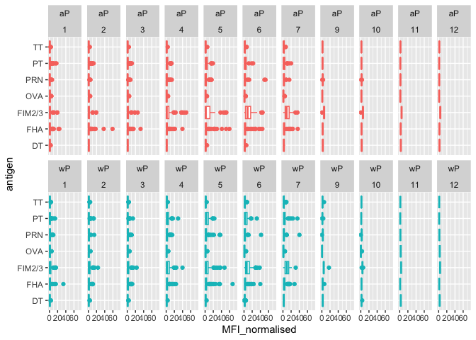

``` r
ggplot(igg) +
  aes(MFI_normalised, antigen, col=infancy_vac) + 
  geom_boxplot() +
  facet_wrap(~infancy_vac)
```

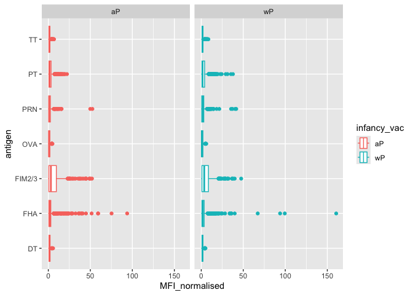

Is there a difference with time (i.e. before booster shot vs after
booster shot)?

``` r
ggplot(igg) +
  aes(MFI_normalised, antigen, col=infancy_vac) + 
  geom_boxplot() +
  facet_wrap(~visit)
```


> Q15. Filter to pull out only two specific antigens for analysis and
> create a boxplot for each. You can chose any you like. Below I picked
> a “control” antigen (“OVA”, that is not in our vaccines) and a clear
> antigen of interest (“PT”, Pertussis Toxin, one of the key virulence
> factors produced by the bacterium B. pertussis).

``` r
filter(igg, antigen=="OVA") %>%
  ggplot() +
  aes(MFI_normalised, col=infancy_vac) +
  geom_boxplot(show.legend = FALSE) +
  facet_wrap(vars(visit)) +
  theme_bw()
```

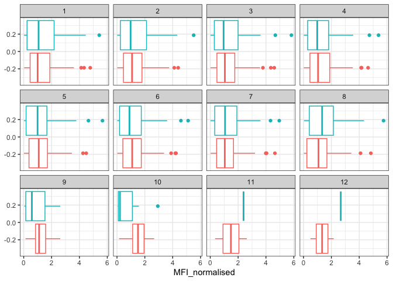

``` r
filter(igg, antigen=="PT") %>%
  ggplot() +
  aes(MFI_normalised, col=infancy_vac) +
  geom_boxplot(show.legend = FALSE) +
  facet_wrap(vars(visit)) +
  theme_bw()
```

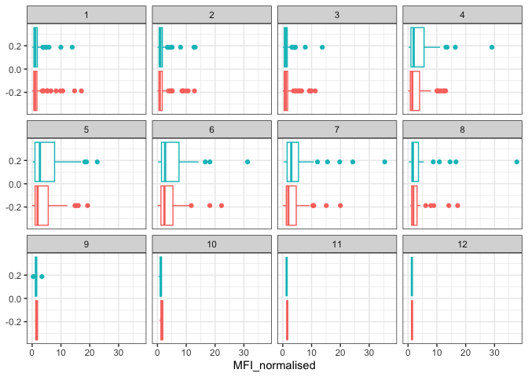

``` r
filter(igg, antigen=="FIM2/3") %>%
  ggplot() +
  aes(MFI_normalised, col=infancy_vac) +
  geom_boxplot(show.legend = FALSE) +
  facet_wrap(vars(visit)) +
  theme_bw()
```

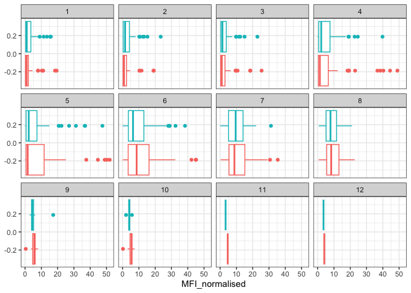

> Q16. What do you notice about these two antigens time courses and the
> PT data in particular?

The two antigens have their levels increase over the course of the
visits. In the PT data, PT levels rise and exceed OVA antigen levels.
The trend follows similarly between wP and aP subjects.

> Q17. Do you see any clear difference in aP vs. wP responses?

There does not seem to be a clear difference in aP vs. wP response as
the ranges and medians seem to be close to each other.

``` r
# Filter to 2021 Dataset

ab.PT.21 <- abdata |> filter(dataset == "2021_dataset", 
                              isotype == "IgG",  antigen == "PT")
  
ggplot(ab.PT.21) +
  aes(x=planned_day_relative_to_boost,
      y=MFI_normalised,
      col=infancy_vac,
      group=subject_id) +
  geom_point() +
  geom_line(alpha = 0.2) +

  # Line of Fit for aP and wP groups
  geom_smooth(aes(group = infancy_vac, col = infancy_vac), 
              se = FALSE, 
              span = 0.3) + 
  
  geom_vline(xintercept=0, linetype="dashed") +
  geom_vline(xintercept=14, linetype="dashed") +
  labs(title="2021 dataset IgG PT",
       subtitle = "Dashed lines indicate day 0 (pre-boost) and 14 (apparent peak levels)") 
```

    `geom_smooth()` using method = 'loess' and formula = 'y ~ x'

    Warning in simpleLoess(y, x, w, span, degree = degree, parametric = parametric,
    : pseudoinverse used at -0.6

    Warning in simpleLoess(y, x, w, span, degree = degree, parametric = parametric,
    : neighborhood radius 3.6

    Warning in simpleLoess(y, x, w, span, degree = degree, parametric = parametric,
    : reciprocal condition number 0

    Warning in simpleLoess(y, x, w, span, degree = degree, parametric = parametric,
    : There are other near singularities as well. 11364

    Warning in simpleLoess(y, x, w, span, degree = degree, parametric = parametric,
    : pseudoinverse used at -0.6

    Warning in simpleLoess(y, x, w, span, degree = degree, parametric = parametric,
    : neighborhood radius 3.6

    Warning in simpleLoess(y, x, w, span, degree = degree, parametric = parametric,
    : reciprocal condition number 0

    Warning in simpleLoess(y, x, w, span, degree = degree, parametric = parametric,
    : There are other near singularities as well. 11364

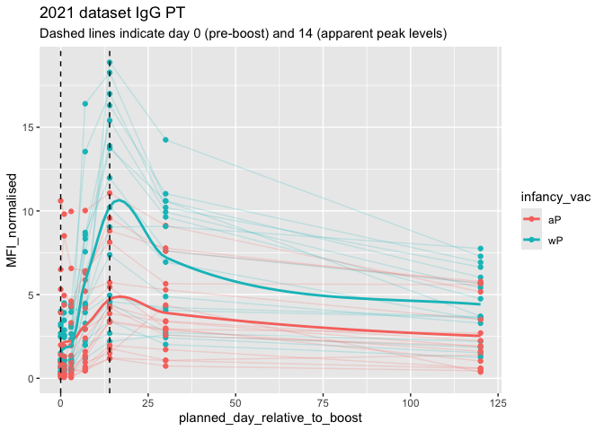

> Q18. Does this trend look similar for the 2020 dataset?

In general, yes, the general trend looks similar to the 2020 dataset.
However, there are a few differences with the 2020 dataset that are
quite apparent such as the peaks between the “aP” and “wP” in the first
14 days.

``` r
# Filter to 2020 Dataset

ab.PT.20 <- abdata |> filter(dataset == "2020_dataset", 
                              isotype == "IgG",  antigen == "PT")
  
ggplot(ab.PT.20) +
  aes(x=planned_day_relative_to_boost,
      y=MFI_normalised,
      col=infancy_vac,
      group=subject_id) +
  geom_point() +
  geom_line(alpha = 0.2) +
  geom_vline(xintercept=0, linetype="dashed") +
  geom_vline(xintercept=14, linetype="dashed") +
  labs(title="2020 dataset IgG PT",
       subtitle = "Dashed lines indicate day 0 (pre-boost) and 14 (apparent peak levels)") 
```

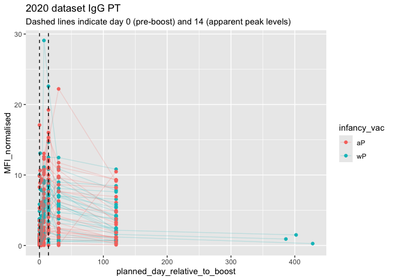

## Obtaining CMI-PB RNASeq Data

``` r
url <- "https://www.cmi-pb.org/api/v2/rnaseq?versioned_ensembl_gene_id=eq.ENSG00000211896.7"

rna <- read_json(url, simplifyVector = TRUE) 
```

``` r
#meta <- inner_join(specimen, subject)
ssrna <- inner_join(rna, meta)
```

    Joining with `by = join_by(specimen_id)`

> Q19. Make a plot of the time course of gene expression for IGHG1 gene
> (i.e. a plot of visit vs. tpm).

``` r
ggplot(ssrna) +
  aes(visit, tpm, group=subject_id) +
  geom_point() +
  geom_line(alpha=0.2)
```


> Q20.: What do you notice about the expression of this gene (i.e. when
> is it at it’s maximum level)?

The expression of the gene was at its maximal level on the 4th day of
visit and slowly reduced over the course of the next two days. One
subject seemed to linearly decrease expression while a majority of
subjects decreased expression levels exponentially.

> Q21. Does this pattern in time match the trend of antibody titer data?
> If not, why not?

Yes, this pattern in time matches the trend of antibody titer data. From
the boxplot data above, we can see that the titer levels increased over
a few days until week 4 and then progressively lowered.

``` r
ggplot(ssrna) +
  aes(tpm, col=infancy_vac) +
  geom_boxplot() +
  facet_wrap(vars(visit))
```


``` r
ssrna %>%  
  filter(visit==4) %>% 
  ggplot() +
    aes(tpm, col=infancy_vac) + geom_density() + 
    geom_rug() 
```

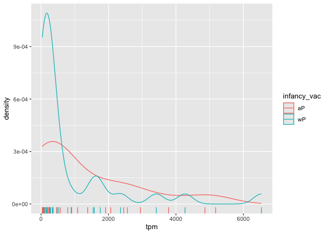
